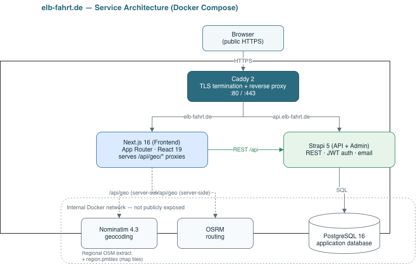

# elb-fahrt.de

*Dieses Projekt wurde im Rahmen der Dorfentwicklung ‚Untere Ilmenau‘ mit Fördermitteln des Landes Niedersachsen und der Europäischen Union (ELER) unterstützt.*

A self-hosted, open-source community carpooling platform (*Mitfahrnetz*) operated by the **Förderverein Binnenmarsch/Elbmarsch**, covering the region around Winsen (Luhe) in northern Germany. Neighbours can offer rides and post ride requests ("Gesuche"), with all geocoding, routing, and map tiles served from the project's own infrastructure — no third‑party cloud APIs and no trackers.

The stack is designed to run entirely on a single small server: a Next.js frontend, a Strapi API, PostgreSQL, and self‑hosted Nominatim (geocoding) and OSRM (routing), all behind Caddy via Docker Compose.

---

## Tech Stack

**Frontend**
- [Next.js 16](https://nextjs.org/) (App Router, Turbopack) · [React 19](https://react.dev/) · TypeScript 5
- [Tailwind CSS v4](https://tailwindcss.com/)
- [MapLibre GL 5](https://maplibre.org/) + [PMTiles](https://protomaps.com/) + `@protomaps/basemaps` — a fully self‑hosted vector map (no tile‑server subscription)

**Backend**
- [Strapi 5](https://strapi.io/) (headless CMS / REST API + admin) on Node 20, TypeScript
- `@strapi/plugin-users-permissions` — JWT auth, roles, email confirmation
- `@strapi/provider-email-nodemailer` — transactional email over SMTP
- [Vitest](https://vitest.dev/) for backend unit tests

**Data & Infrastructure**
- [PostgreSQL 16](https://www.postgresql.org/) (application database)
- [Nominatim 4.3](https://nominatim.org/) — address geocoding on a clipped regional OSM extract
- [OSRM](https://project-osrm.org/) — driving distance/duration on the same extract
- [Caddy 2](https://caddyserver.com/) — automatic HTTPS + reverse proxy
- [Docker Compose](https://docs.docker.com/compose/) — six‑service stack, deployed on Hetzner Cloud

---

## Getting Started

### Prerequisites

- **Node.js 20+** and npm
- **Docker Engine + Compose v2** (on macOS, [Colima](https://github.com/abiosoft/colima) is the recommended runtime)
- **Regional data artifacts** (large, git‑ignored — see below):
  - `osrm-data/` — the OSM extract plus the prepared Nominatim/OSRM import files
  - `frontend/public/region.pmtiles` — the vector map tiles for the region

### Regional data (one‑time)

These files are excluded from git because of their size and are generated from a regional OpenStreetMap extract:

```bash
# OSM extract + OSRM/Nominatim inputs (edit the bounding box inside the script)
./scripts/prepare-osm-data.sh

# Map tiles: extract the region from a Protomaps daily build with the `pmtiles` CLI
pmtiles extract <planet-source-url> frontend/public/region.pmtiles --bbox=...
```

### Self‑hosted map assets

The map is fully self‑hosted — it makes **no third‑party requests** at runtime. Three pieces are served from the frontend's own origin:

- **Tiles** — `frontend/public/region.pmtiles` (git‑ignored due to size; generated with the `pmtiles` CLI above and placed on the server out‑of‑band).
- **Glyphs + sprite** — the label fonts and icons, in `frontend/public/basemaps-assets/`. Unlike the tiles these are small and **committed to the repo**, so the server build picks them up automatically. Populate them once with:

  ```bash
  ./scripts/fetch-basemap-assets.sh
  ```

  This mirrors exactly the font stacks the Protomaps *light* flavor requests (Noto Sans Regular / Medium / Italic) plus the sprite. Re‑run it only if the map style's font stacks change. The asset URLs live in `frontend/lib/map/basemap.ts`.

### Local development

The **frontend runs on the host** (native `next dev` for reliable hot‑reload); **everything else runs in Docker**. The `docker-compose.override.yml` supplies dev‑only settings (Mailpit mail catcher, host‑exposed geo ports, polling).

```bash
# 1. Configure environment (fill in secrets, e.g. `openssl rand -base64 32`)
cp .env.example .env

# 2. Start the backend + data services in Docker
colima start --cpu 4 --memory 6                        # macOS Docker VM
docker compose up -d postgres strapi nominatim osrm mailpit

# 3. Run the frontend on the host
cd frontend && npm install && npm run dev               # http://localhost:3000
```

Useful local endpoints:

| Service        | URL                            |
| -------------- | ------------------------------ |
| Frontend       | http://localhost:3000          |
| Strapi admin   | http://localhost:1337/admin    |
| Mailpit (mail) | http://localhost:8025          |

### First‑run Strapi configuration

Some settings live in the database, not in code, and must be set once per environment via **Settings → Users & Permissions plugin**:

1. **Roles → Authenticated** — grant `find`, `findOne`, `create`, `update`, `delete` on `ride`, `ride-request`, and `booking`, plus `me.updateProfile`, `me.listBookings`, and `me.deleteAccount`. Confirm the **Public** role has none of these.
2. **Advanced settings** — enable email confirmation; set the redirect URL to `http://localhost:3000/verify-email` (or the production URL).
3. **Email templates** — set the sender address to a mailbox you can actually send from.

### Tests

```bash
cd backend && npm test        # Vitest: booking rules, ID checksums, Gesuch contact policy
```

---

## Architecture & File Structure

### How the services interact



*An editable version of this diagram is in [`docs/architecture.drawio`](docs/architecture.drawio).*

Key design points:

- **Geo proxy.** The browser never talks to Nominatim/OSRM directly. Address search, reverse‑geocoding, and route previews go through same‑origin Next.js route handlers under `frontend/app/api/geo/*`, which reach the geo services over the internal Docker network. This avoids CORS and keeps those services unexposed.
- **PII tiers.** The backend enforces two projections of user data: `SAFE_USER_FIELDS` (first name and travel preferences, used for browsing) and `CONTACT_USER_FIELDS` (name + mobile), which is only ever returned after a confirmed booking. See `backend/src/utils/safe-user.ts`.
- **`/me` endpoints.** Custom, JWT‑scoped routes (`backend/src/api/me`) handle profile updates, the "Meine Fahrten" view (`/me/bookings`), and GDPR account deletion — always acting on `ctx.state.user`, never a URL id.
- **Controller‑side filtering.** Strapi rejects client‑supplied filters on the `users-permissions` relation, so ownership/availability filtering (hiding your own and fully‑booked rides from the overview) is done inside the ride/ride‑request controllers using scalar `documentId` exclusion.
- **Validate‑and‑discard driver check.** A driver's ID number is checksum‑validated (`backend/src/utils/modulo10.ts`) and immediately discarded; only the verification outcome is stored.

### Repository layout

```
elb-fahrt.de/
├── backend/                     # Strapi 5 API + admin
│   ├── src/
│   │   ├── api/                  # content types + hardened controllers
│   │   │   ├── ride/             #   ride offers (Angebote)
│   │   │   ├── ride-request/     #   ride requests (Gesuche)
│   │   │   ├── booking/          #   seat bookings + booking-rules (pure, unit-tested)
│   │   │   ├── me/               #   /me/profile, /me/bookings, /me/account
│   │   │   └── driver-settings/  #   auto-approve toggle (single type)
│   │   ├── extensions/users-permissions/  # extended User schema
│   │   └── utils/                # safe-user (PII tiers), modulo10 (ID checksum)
│   └── config/                  # database, plugins (email), middlewares (CORS)
├── frontend/                    # Next.js 16 (App Router)
│   ├── app/
│   │   ├── page.tsx              # overview: Angebote / Gesuche (list + map)
│   │   ├── rides/ requests/      # composers + ride detail/booking
│   │   ├── meine-fahrten/        # the caller's trips (passenger + driver)
│   │   ├── mein-profil/          # profile editing + account deletion
│   │   ├── sign-in/ sign-up/ verify-driver/ verify-email/ role-picker/
│   │   ├── impressum/ datenschutz/ mitmachen/
│   │   └── api/geo/{search,reverse,directions}/  # server-side geo proxies
│   ├── components/              # Header, Footer, AddressField, LocationPicker,
│   │                            #   RideMap, CardSummary, PasswordInput, …
│   └── lib/api/                 # typed API client (auth, rides, requests,
│                                #   bookings, geo, types)
├── scripts/                     # prepare-osm-data.sh, pg-backup.sh, init-db.sh
├── legal/                       # Impressum + Datenschutzerklärung (drafts)
├── osrm-data/                   # (git-ignored) OSM extract + import data
├── docker-compose.yml           # production stack (6 services)
├── docker-compose.override.yml  # dev overrides (Mailpit, host ports, polling)
├── Caddyfile                    # HTTPS + reverse proxy
└── .env.example                 # required environment variables
```

---

## API / Usage Examples

All API calls are authenticated with a JWT (`Authorization: Bearer <token>`) obtained from `POST /api/auth/local`.

**List active ride offers (server hides your own and fully‑booked one‑off rides):**

```bash
curl "https://api.elb-fahrt.de/api/rides?filters[status][\$eq]=active&sort=departure_at:asc" \
  -H "Authorization: Bearer $JWT"
```

**Book a seat** (the controller forces `passenger = you`, sets the status, and enforces seat limits):

```bash
curl -X POST "https://api.elb-fahrt.de/api/bookings" \
  -H "Authorization: Bearer $JWT" -H "Content-Type: application/json" \
  -d '{"data": {"ride": "<ride-documentId>", "instance_date": null}}'
```

**"Meine Fahrten"** — the one endpoint that returns contact details (only for confirmed bookings):

```bash
curl "https://api.elb-fahrt.de/api/me/bookings" -H "Authorization: Bearer $JWT"
# → { as_passenger, as_driver, as_requester, offered_rides }
```

**Frontend — typed client** (`frontend/lib/api`):

```ts
import { getMyBookings } from '@/lib/api/bookings';
import { createRide } from '@/lib/api/rides';

// Read the current user's trips
const { as_passenger, offered_rides } = await getMyBookings();

// Offer a ride — the backend forces driver = me and requires an approved driver
await createRide({
  origin_address: 'Elbdeich, 21423 Drage',
  origin_lat: 53.407, origin_lng: 10.259,
  destination_address: 'Bahnhof, Winsen (Luhe)',
  destination_lat: 53.3636, destination_lng: 10.2059,
  departure_at: new Date('2026-09-01T08:10:00').toISOString(),
  recurrence: 'none',
  seats_total: 3,
  flexible_origin: true, flexible_destination: false,
  gender_filter: 'none',
});
```

---

## Deployment

Production runs the full stack from the **base compose file only** (never the dev override) behind Caddy, on a Hetzner CX22:

```bash
docker compose -f docker-compose.yml up -d --build
```

Notes:

- **Rebuild the right service.** Frontend code is baked into its image at build time (`NEXT_PUBLIC_*` are inlined), and the Strapi app is compiled into its image. After a **backend** change you must rebuild `strapi` (`docker compose -f docker-compose.yml up -d --build --force-recreate strapi`); a frontend‑only rebuild silently skips backend changes.
- **First boot** runs the one‑time Nominatim import (memory‑hungry) and Caddy's Let's Encrypt certificate issuance (requires DNS pointing at the host).
- **Email deliverability** needs SPF and DKIM DNS records for the sending domain, plus a strict DMARC policy — otherwise confirmation mails are rejected or filtered.
- **Backups:** `scripts/pg-backup.sh` dumps the database; schedule it via cron and copy the output off‑box.

---

## Error monitoring

Errors from both the frontend and Strapi are reported to a **self‑hosted
[Bugsink](https://www.bugsink.com/)** instance (Sentry‑SDK compatible) — a single
lightweight container in the compose stack, published only at
`errors.elb-fahrt.de`. No third‑party service is involved (`PHONEHOME=False`),
and a PII scrubber runs in every event's `beforeSend` (drops user, cookies,
headers, query strings; redacts email/phone patterns), so no personal data
leaves the app — important given minors on the platform.

The SDKs are **inert until a DSN is set**, so the app runs fine before Bugsink is
configured. One‑time setup:

1. Set `BUGSINK_SECRET_KEY` (`openssl rand -base64 50`) and `BUGSINK_SUPERUSER`
   (`email:password`) in `.env`, point `errors.elb-fahrt.de` DNS at the host,
   and deploy: `docker compose -f docker-compose.yml up -d bugsink`.
2. Log in at `https://errors.elb-fahrt.de`; create two projects, **frontend**
   and **backend**.
3. Put their DSNs in `.env` as `SENTRY_DSN_FRONTEND` and `SENTRY_DSN_BACKEND`.
4. Rebuild — the frontend DSN is baked into the browser bundle, so the frontend
   must be rebuilt: `docker compose -f docker-compose.yml up -d --build --force-recreate frontend strapi`.

Wiring lives in `frontend/instrumentation*.ts` + `frontend/sentry.*.config.ts`
(client/server/edge) and `backend/config/plugins.ts` (`sentry` plugin); the
shared scrubber is `frontend/lib/monitoring/scrub.ts`. Source‑map upload is not
configured, so frontend stack traces are minified for now — add a Sentry auth
token + `withSentryConfig` later if readable traces are needed.

---

## License

Copyright © 2026 **Lucas Millheim**.

This program is free software: you can redistribute it and/or modify it under the terms of the **GNU Affero General Public License** as published by the Free Software Foundation, either version 3 of the License, or (at your option) any later version. The full text is in [`LICENSE`](LICENSE).

Because this is the **AGPL‑3.0**, anyone who runs a modified version as a network service must make the corresponding source available to that service's users (see section 13 of the license).

Map data © OpenStreetMap contributors, available under the [Open Database License (ODbL)](https://www.openstreetmap.org/copyright).
